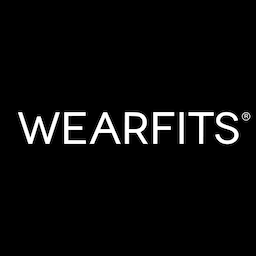

# WEARFITS® API

**[WEARFITS®](https://wearfits.com) is a comprehensive web application designed for virtual try-ons and size fitting. Leveraging modern web technologies like 3D, Augmented Reality (AR), Machine Learning, and Generative AI, WEARFITS® provides users with an interactive and seamless experience to visualize garments and accessories in both apparel and footwear contexts.**

## Products

| Category                | Solution                | Description                                                                 | Implementation Requirements                                         |
|------------------------|-----------------------|-----------------------------------------------------------------------------|-----------------------------------------------------|
| Footwear & Bags  | **[AR Try-On](footwear_bags.md#footwear-and-bags-ar-try-on)**             | Virtual try-on in AR and Digital Mirror for footwear, bags, and backpacks | 3D model of a product (`OBJ`, `GLB`, `FBX`, etc.)            |
| Footwear & Bags                   | **[2D-to-3D Converter](footwear_bags.md#footwear-and-bags-2d-to-3d-converter)**    | Automatic conversion of 2D images into 3D models, useful for shoes and bags digitization | Studio photographs (>30) of a product (`JPG`, `PNG`)       |
| Footwear  | **[Scan and Fit](footwear_bags.md#footwear-scan-and-fit)**    | Mobile app for precise foot measurements and accurate size recommendations  | Shoe last measurements (e.g. `CSV`, `XLS` or API integration)       |
| Apparel                 | **[3D Virtual Try-On](apparel.md#apparel-3d-virtual-try-on-and-size-fitting)**             | Visualization and size fitting of apparel in 3D on mannequin-like avatars of your silhouette size     | Parametric 3D model of a garment (`ZPAC`)           |
| Apparel                 | **[Size Fitting and Heatmap](apparel.md#apparel-size-recommendation-and-heatmap)**          | Fit heatmaps and size recommendations                                       | Sizing tables or garment measurements (e.g. `CSV`, `XLS` or API integration)       |
| Apparel                 | **[Gen-AI Try-On](apparel.md#apparel-generative-ai-try-on)**             | Visualization of garments on yourself with AI-generated images              | 1 photo of a garment (`JPG`, `PNG`)                   |
| Apparel                 | **[AR Try-On](apparel.md#apparel-ar-try-on)**             | Visualization of garments in AR on yourself                  | 3D model of a garment (`OBJ`, `GLB`, `FBX`, etc.)              |
| Any object                   | **[3D and AR Viewer](footwear_bags.md#3d-and-ar-viewer)**        | Instant visualization of 3D models of any objects on the web and in AR     | 3D model of an object (`OBJ`, `GLB`, `FBX`, etc.)              |

*Check also our [examples repository](examples/README.md).*

## Contact

**For any questions, inquiries, or to request an account, please email us at [contact@wearfits.com](mailto:contact@wearfits.com) or schedule an online meeting via [Calendly](https://calendly.com/lukasz-rzepecki/30min).**

© 2024 [WEARFITS](https://wearfits.com). All rights reserved.