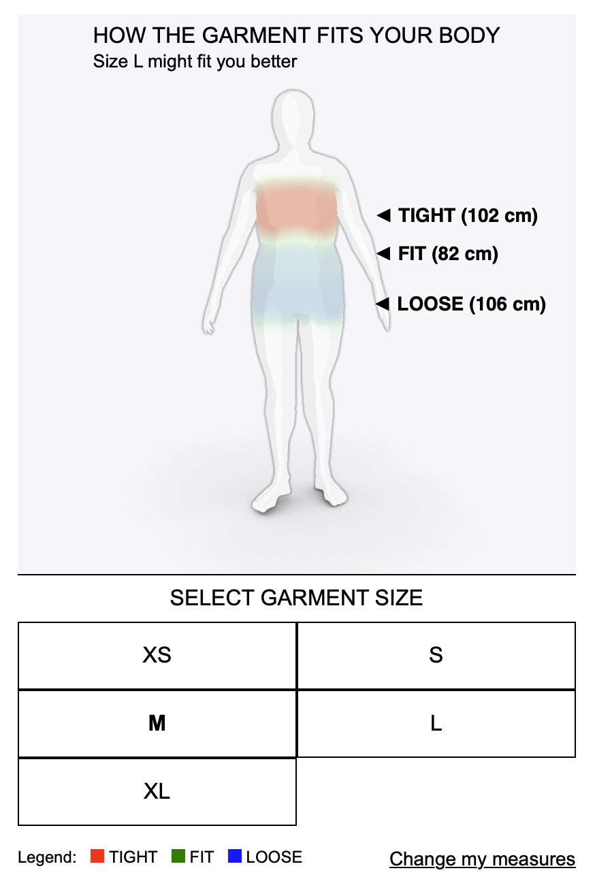

*Go back to the [main README](README.md).*

## NEW

➡️ Check out our new Generative AI Clothing and Shoes Try-On: [https://tryon.wearfits.com](https://tryon.wearfits.com)

## Apparel: 3D Virtual Try-On and Size Fitting

The 3D Try-On Viewer enables users to virtually try on apparel in 3D on avatars of their size. It supports web-based and AR visualizations, providing a versatile platform for different user experiences. The built-in comfort heatmap allows for accurate size fitting.

### Demo

A legacy demo for 3D apparel try-on is available at: [https://dev.wearfits.com/demo-apparel](https://dev.wearfits.com/demo-apparel)

### Digitization

Our platform is compatible with 3D models of garments in the `ZPAC` format.

1. Use CLO3D to put the garment on the WEARFITS avatar and export the `ZPAC` file.
2. Upload the `ZPAC` file to the WEARFITS garment admin and process it on the selected avatar.
3. Set the garment ID and wait for the results.
4. Check the results: `https://dev.wearfits.com/render3/<id>`

*💡 The size fitting solution (heatmaps without garment visualizations) doesn't require 3D models of garments - only product measurements or general sizing tables.*

### JavaScript API

Examples:
- GitHub: [examples/1-wearfits-virtualfitting-room.html](examples/1-wearfits-virtual-fitting-room.html)
- CodePen: [https://codepen.io/wearfits/pen/oNKjVeZ](https://codepen.io/wearfits/pen/oNKjVeZ)

1. Import WEARFITS CSS and JavaScript components:

    ```html
    <link rel="stylesheet" href="https://dev.wearfits.com/static/css/virtual-advisor.css">

    <script type="text/javascript" src="https://dev.wearfits.com/static/js/wearfits.fr.bundle.min.js"></script>

    <script type="text/javascript" src="https://dev.wearfits.com/static/js/virtual_advisor.js"></script>
    ```

2. Prepare a DIV placeholder:

    ```html
    <div id="wearfits_viewer"></div>
    ```

    You can customize the style, but don't change the ID (`wearfits_viewer`).

3. Add JavaScript code:

    ```html
    <script>
        // Required parameter:
        wearfits.current_garment_name = "<id>";
        
        // Optional parameters:
        wearfits.showRayTracingButton = false;
        wearfits.showARButton = true;
        wearfits.showMaterialPresets = true;
        wearfits.showSizeSelectionUI = true;
        wearfits.showAvatarSelectionUI = true;
        wearfits.showComfortMapButton = true;
        wearfits.controlsType = "MOUSE_POSITION";
        
        // Required action:
        wearfits.loadDefaultOrCreateIt();
    </script>
    ```

#### JavaScript Parameters

| Parameter | Type | Description | Accepted Values | Default Value |
| --- | --- | --- | --- | --- |
| `current_garment_name` (required) | `string` | The ID of the current garment | ID / name of the garment (without `<` `>`) | `null` |
| `showRayTracingButton` | `boolean` | Show or hide the ray tracing button | `true`, `false` | `false` |
| `showARButton` | `boolean` | Show or hide the AR button | `true`, `false` | `true` |
| `showMaterialPresets` | `boolean` | Show or hide material presets | `true`, `false` | `true` |
| `showSizeSelectionUI` | `boolean` | Show or hide size selection UI | `true`, `false` | `true` |
| `showAvatarSelectionUI` | `boolean` | Show or hide avatar selection UI | `true`, `false` | `true` |
| `showComfortMapButton` | `boolean` | Show or hide comfort map button | `true`, `false` | `true` |
| `controlsType` | `string` | Type of controls to use | `MOUSE_POSITION` | `MOUSE_POSITION` |

#### Multiple Instances of Viewers

To embed multiple viewers on the same website, load the JS file with the `instancesCount` parameter as shown below:

```html
<script type="text/javascript" src="https://dev.wearfits.com/static/js/wearfits.fr.bundle.min.js?instancesCount=2"></script>
```

For additional viewers, use `wearfits_X` object names (e.g., `wearfits`, `wearfits_1`, `wearfits_2`, etc.).

Examples:

- In `<script>` tag:

    ```javascript
    wearfits_1.canvas_container_id = "wearfits_viewer2";
    wearfits_1.loadDefaultOrCreateIt();
    // [...]
    ```

- In `<body>` tag:

    ```html
    <div id="wearfits_viewer2" style="width:100%; height:100%;"></div>
    ```

#### Advanced Implementation

An advanced implementation example with external and customized controls can be found [here](examples/13-wearfits-apparel-and-size-fitting-demo.html). Please check the source code to examine it.

To display two garments on the avatar, use the following function instead of `loadDefaultOrCreateIt()`:

```javascript
wearfits.loadByHashAndId("<avatar_id>", ["<id1>_<size>", "<id2>_<size>"]);
```

Example:

```javascript
wearfits.loadByHashAndId("51a2dc298a9ed146e1d6844b6558468e", ["Burda8_38", "Szorty_38"]);
```

To get the preferred size, use this function:

```javascript
wearfits.getPreferedSize();
```

or:

```javascript
wearfits.fetchGarmentMetadata(user_measurements, garment_name, garment_color);
```

It returns:
This function communicates asynchronously by posting a message to the parent window with the following structure:
```json
{
    "name": "fetchGarmentMetadata",
    "data": {
        "garment_name": "<string>",
        "user_measurements": "<object>",
        "preferred_size": "<string>",
        "sizes": ["<string>", "<string>", "..."]
    }
}
```

To change the style of the fit information text, modify the CSS class `wearfits-fit-info-text`:

```css
.wearfits-fit-info-text {
  font-size: 12px;
}
```

To dynamically update the avatar and/or garment, use the following function:

```javascript
wearfits.updateAvatarAndGarment(user_measurements, garment_name, garment_size, garment_color);
```

This function communicates asynchronously by posting a message to the parent window with the following structure:
```json
{
    "name": "updateAvatarAndGarment",
    "data": {
        "garment_name": "<string>",
        "garment_size": "<string>",
        "garment_color": "<string>",
        "user_measurements": "<object>",
        "fit_data": {
            "chest": "<string>",
            "waist": "<string>",
            "buttock": "<string>"
        },
        "garment_measurement_3d": {
            "height": "<int>"
        },
        "preferred_size": "<string>"
    }
}
```

### IFRAME

Use one of the following endpoints in the IFRAME source:

- `/render` - The best style for embedding via IFRAME inside a website

    ```html
    <iframe src="https://dev.wearfits.com/render/<id>?lang=en&size=M"></iframe>
    ```

- `/render3` - The best style for top layer, new tab/window, or mobile standalone view

    ```html
    <iframe src="https://dev.wearfits.com/render3/<id>?lang=en&size=M"></iframe>
    ```

#### Query String Parameters

| Parameter         | Type     | Description                                                   | Accepted Values                     | Default Value                       |
|-------------------|----------|---------------------------------------------------------------|-------------------------------------|-------------------------------------|
| `id` (required)           | `string` | Specifies the ID of the garment                       | ID / name of the garment (without `<` `>`)  | `null` |
| `size` (recommended)            | `string` | Specifies the size of the garment                            | `S`, `M`, `40`, etc.  (same as set in admin)                | `M`                                 |
| `preset`          | `string` | Specifies the garment color                          | Color preset name (e.g., `variant1`) | `null`                              |
| `lang`            | `string` | Specifies the language for the viewer                       | `en`, `fr`, `es`, etc.              | `en`                                |
| `nocolorlist`     | `number`    | Hides the garment color selection list when set to `1`      | `0` or `1`                          | `0`                                 |
| `noavatarselection`| `number`    | Disables the avatar selection when set to `1`               | `0` or `1`                          | `0`                                 |
| `nocomfortbutton` | `number`    | Hides the comfort (heatmap) button when set to `1`                    | `0` or `1`                          | `0`                                 |
| `norenderbutton`  | `number` | Hides the HQ render button when set to `1`                     | `0` or `1`                          | `0`                                 |
| `controlstype`    | `string` | Specifies the type of controls for the viewer               | `mouse`					  | `mouse`                             |
| `background`       | `string` | Sets the background color of the viewer                      | Hex color code (e.g., `ffffff` for white) | `ffffff`                            |
| `nopan`            | `number` | Disables panning (two-finger object move) when set to `1`  | `0` or `1`                          | `0`                                 |
| `nofittext`        | `number` | Disables fit info text when set to `1`                           | `0` or `1`                          | `0`                                 |
| `nozoom`           | `number` | Disables zoom when set to `1`                    | `0` or `1`                          | `0`                                 |
| `nosizeselection` | `number` | Disables size selection when set to `1`                           | `0` or `1`                          | `0`                                 |
| `noar`            | `number` | Hides the AR button when set to `1`                               | `0` or `1`                          | `0`                                 |


Example URL: `https://dev.wearfits.com/render3/Burda3?preset=wariant2&nocolorlist=0&lang=en&size=40`


## Apparel: Size Recommendation and Heatmap



The Size Recommendation and Heatmap feature provides accurate size recommendations and visualizes fit areas using a comfort heatmap. This solution doesn't require 3D models - only product measurements.

Examples:

- **GitHub:** [examples/16-wearfits-size-fitting-recommendation-demo.html](examples/16-wearfits-size-fitting-recommendation-demo.html)
- **CodePen:** [https://codepen.io/wearfits/pen/MWNMZRO](https://codepen.io/wearfits/pen/MWNMZRO)

### JavsScript API

1. Import required files:
```html
<script src="https://dev.wearfits.com/static/js/wearfits.fr.bundle.min.js"></script>
<script src="https://dev.wearfits.com/static/js/virtual_advisor.js"></script>
```

2. Define garment data with measurements:
```javascript
const demo_garment = {
    name: "DEMO GARMENT",
    product_type: "DRESS", // See supported types below
    gender: "w",  // "m" for men, "w" for women
    sizes: [{
        name: "XS",
        chest: 90,
        waist: 70,
        buttock: 94,
        length: 95
    }, {
        name: "S", 
        chest: 96,
        waist: 76,
        buttock: 100,
        length: 96
    }]
    // ... more sizes
};
```

3. Implement custom fit calculation (optional):
```javascript
async function customFitFunc() {
    const properties = wearfits.garmentProp[wearfits.current_garment_name];
    const selectedSize = wearfits.current_garment_size;
    const measurements = properties.custom.measurement[selectedSize];

    // Calculate fit for key measurements
    ['chest', 'waist', 'buttock'].forEach(prop => {
        if (measurements[prop]) {
            const diff = measurements[prop] - wearfits.userParams[prop];
            
            // Determine fit category
            let fitText;
            if (Math.abs(diff) <= 2) {
                fitText = "FIT";
            } else if (diff > 2) {
                fitText = "LOOSE";
            } else {
                fitText = "TIGHT";
            }

            // Override display text and difference values
            wearfits.measurements[prop].override_text = fitText + " (" + measurements[prop] + " cm)";
            wearfits.measurements[prop].override_diff = diff;
        }
    });
}
```

#### Supported Product Types

Each product type supports different measurement areas:

| Product Type | Supported Measurements |
|-------------|----------------------|
| `"TROUSERS"` | waist, buttock, product_length |
| `"DRESS"` | chest, waist, buttock, upperarm, product_length |
| `"BERMUDA"` | waist, buttock, product_length |
| `"LEGGINGS"` | waist, buttock, product_length |
| `"SKIRT"` | waist, buttock, product_length |
| `"TOPS AND OTHERS"` | chest, product_length, shoulders |
| `"BLAZER"` | chest, product_length, shoulders, upperarm |
| `"WAISTCOAT"` | chest, product_length, shoulders |
| `"SHIRT"` | chest, product_length, shoulders, upperarm |
| `"T-SHIRT"` | chest, product_length, shoulders |

#### Methods

| Method | Description | Example |
|--------|-------------|---------|
| Get preferred size | Retrieves the preferred size for the user | ```wearfits.getPreferedSize(); ``` |
| Update fit data | Updates the fit data for the current garment | ```wearfits.update_fit_data(); ``` |
| Get correct size for measurements | Gets the correct size for the given measurements | ```wearfits.getCorrectSize(garment_name, size); ``` |

#### Customization Options

The following properties can be configured:

| Property | Description | Example Value |
|----------|-------------|---------------|
| `wearfits_va.use_outline` | Enable/disable outline | `true` |
| `wearfits_va.custom_fit_func` | Custom fit calculation | `customFitFunc` |
| `wearfits_va.default_mode_ratio` | Default mode ratio | `1.5` |
| `wearfits_va.text_mode` | Enable/disable text mode | `false` |

For styling the fit information text:
```css
.wearfits-fit-info-text {
    font-size: 12px;
    /* Add custom styles */
}
```


## Apparel: Generative AI Try-On

Generative AI allows for photo-realistic visualization of garments on users with just one photo of a garment.
- Demo: [https://tryon.wearfits.com](https://tryon.wearfits.com)
- More information: [https://tryon.wearfits.com/docs/integration](https://tryon.wearfits.com/docs/integration)

## Apparel: AR Try-On

Augmented Reality allows users to visualize garments on themselves in real-time. [Ask us](#contact) for a demo.

*Go back to the [main README](README.md).*

## Contact

**For any questions, inquiries, or to request an account, please email us at https://wearfits.com/contact?s=support**

© 2026 [WEARFITS](https://wearfits.com). All rights reserved.